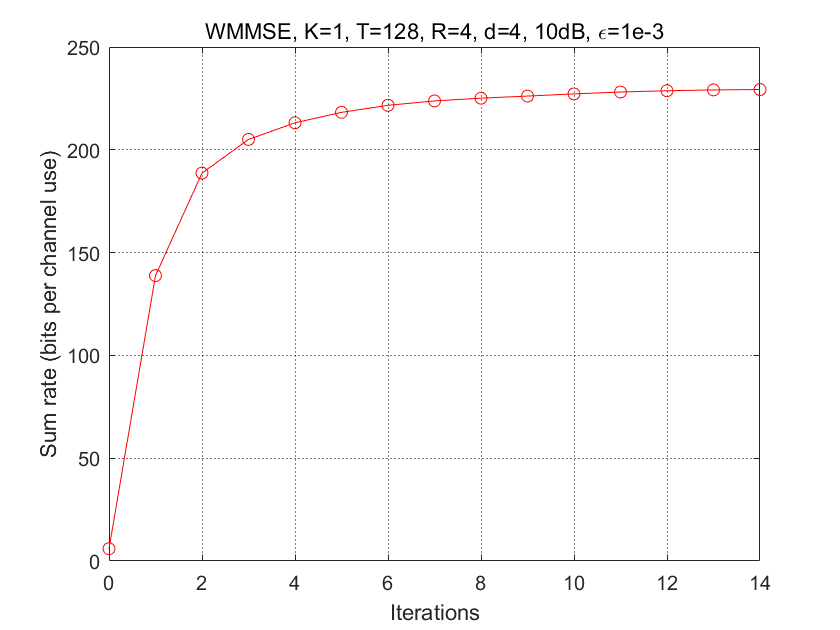

# WMMSE
This is the MATLAB code implementation for the WMMSE algorithm.
[CLick me for the original paper link]<http://ieeexplore.ieee.org/document/5756489/>
# Code Introduction
WMMSE.m : The main function.
find_U.m : the function for finding the U in each iteration of the WMMSE algorithm.
find_W.m : the function for finding the W in each iteration of the WMMSE algorithm.
find_V.m : the function for finding the V in each iteration of the WMMSE algorithm.
# Result
Run WMMSE.m in matlab and get the following figure:

