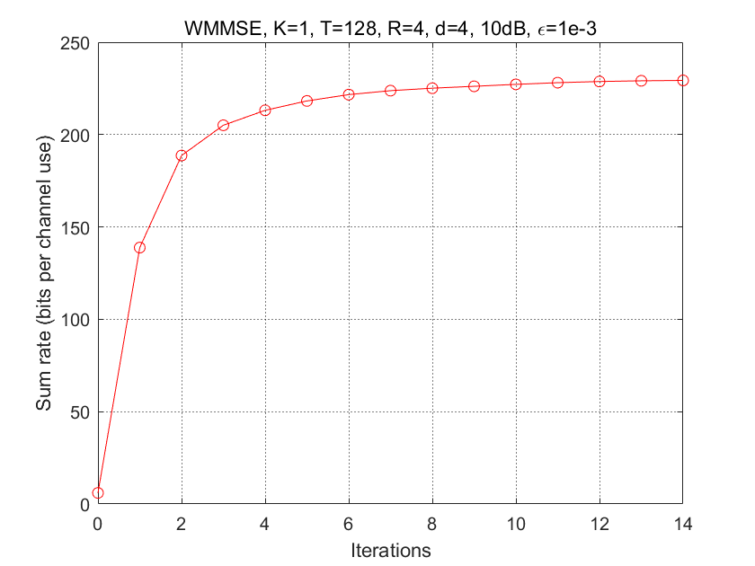

# WMMSE
This is the MATLAB code implementation for the WMMSE algorithm with **GPU acceleration support**.  
Click here for the original paper link: [An Iteratively Weighted MMSE Approach to Distributed Sum-Utility Maximization for a MIMO Interfering Broadcast Channel](http://ieeexplore.ieee.org/document/5756489/)  

## GPU Acceleration 🚀
This implementation now includes GPU acceleration using MATLAB's Parallel Computing Toolbox, providing significant performance improvements for large-scale MIMO systems.

### Performance Benefits
- **Matrix Operations**: Accelerated matrix multiplications, inversions, and linear system solving
- **Parallel Processing**: Concurrent processing across multiple users and antennas  
- **Memory Efficiency**: Reduced data transfer between CPU and GPU
- **Scalability**: Better performance for larger antenna arrays and user counts

### Requirements for GPU Acceleration
- MATLAB with Parallel Computing Toolbox
- CUDA-compatible GPU
- Sufficient GPU memory (typically 2GB+ for default parameters)

# Code Introduction
**WMMSE.m** : The main function with automatic GPU/CPU detection and fallback.  
**WMMSE_GPU.m** : GPU-optimized version (requires GPU, faster performance).  
**find_U.m** : The function for finding the U in each iteration (GPU/CPU compatible).  
**find_W.m** : The function for finding the W in each iteration (GPU/CPU compatible).  
**find_V.m** : The function for finding the V in each iteration (GPU/CPU compatible).   
**sum_rate.m** : The function for computing the weighted sum rate (GPU/CPU compatible).  
**GPU_Performance_Test.m** : Performance comparison script between CPU and GPU versions.

## Usage

### Automatic Mode (Recommended)
```matlab
% Automatically detects and uses GPU if available, falls back to CPU
run('WMMSE.m')
```

### GPU-Only Mode  
```matlab
% Forces GPU usage (errors if GPU not available)
run('WMMSE_GPU.m')
```

### Performance Testing
```matlab
% Compare CPU vs GPU performance
run('GPU_Performance_Test.m')
```

## GPU Acceleration Details

### Accelerated Operations
1. **Channel Matrix Operations**: Complex matrix multiplications for H, V, U matrices
2. **Linear System Solving**: GPU-accelerated `\` operator for matrix inversion
3. **Eigenvalue Operations**: Faster determinant computations for rate calculations
4. **Bisection Method**: Parallel dual variable optimization in `find_V`

### Memory Management
- Automatic GPU memory allocation with `gpuArray()`
- Efficient data transfer using `gather()` only when necessary
- GPU memory cleanup after algorithm completion

### Compatibility
- **Backward Compatible**: All functions work with both CPU and GPU arrays
- **Graceful Fallback**: Automatically uses CPU if GPU is unavailable
- **Error Handling**: Proper error messages for GPU-related issues

# Result  
Run WMMSE.m in matlab and get the following figure:  
  

The GPU-accelerated version will show "GPU Accelerated" in the title when GPU is used.

## Performance Expected
Typical speedup on modern GPUs (RTX 3080/4080 class):
- **2-5x faster** for default parameters (T=128, R=4, I=16)  
- **5-10x faster** for larger systems (T=256+, I=32+)
- **Memory usage**: ~1-3GB GPU memory for large configurations

## Star History

[](https://star-history.com/#FenghaoZhu/WMMSE&Date)
